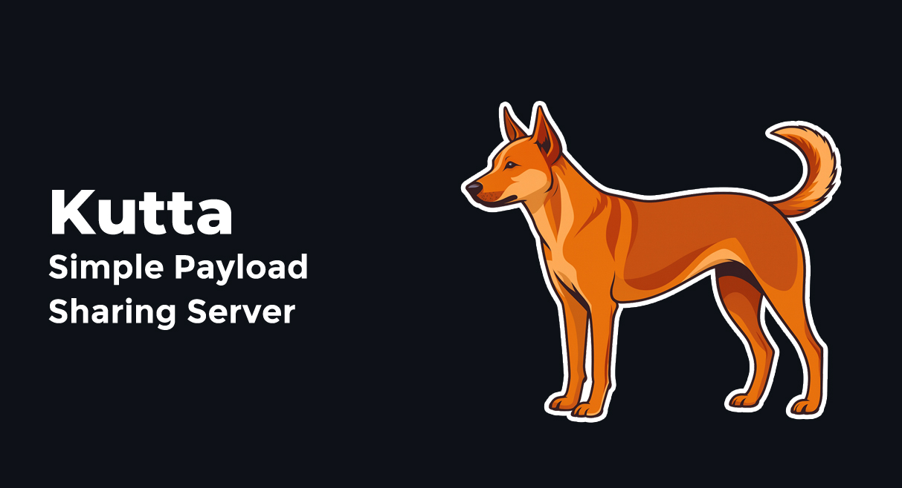
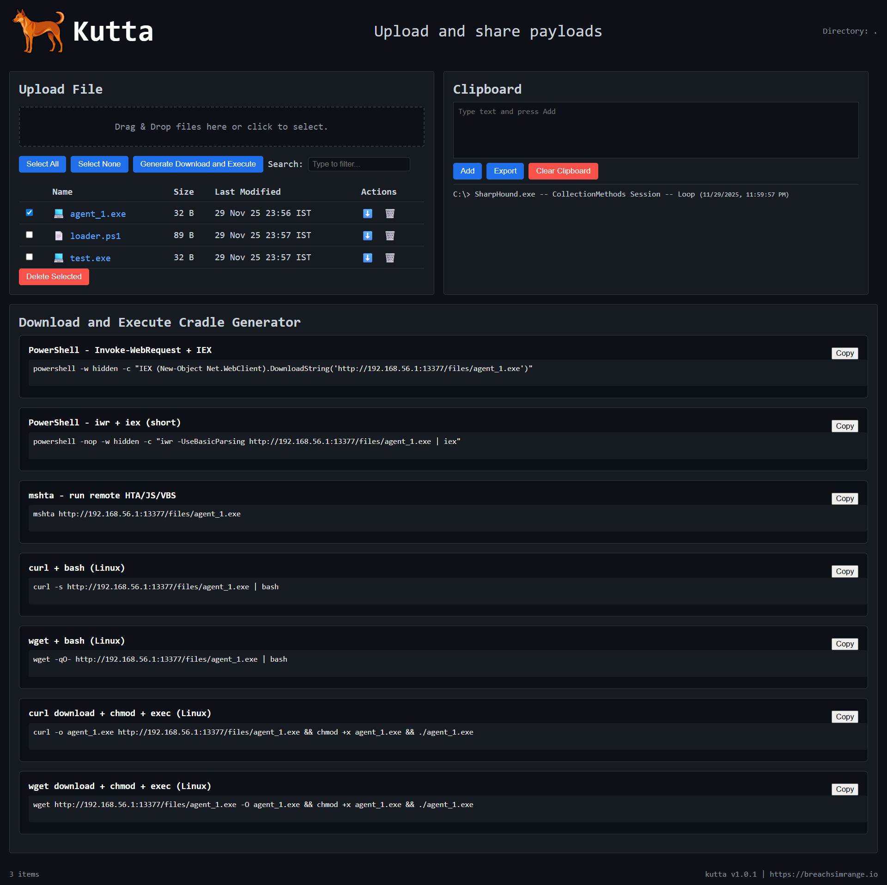

# Kutta Simple Payload Sharing Server


**Kutta** is a lightweight, responsive web-based file sharing server written in **Go**.
It was created to use during our trainings to move payloads and code snippets across machines in the lab environment.
It is an alternative tool for python http.server, motivated from tools like `goshs` and `updog`, with extra features.
I had a loyal indie dog named 'Kuttan' when I was a kid. Meaning in Malayalam language would be 'Boy'\'Good boy'. 'Kutta' in Hindi language would mean, 'Dog".

## Features

* **Directory Browsing** - Navigate and download files/folders
* **File Upload** - Drag & drop, file picker, or `curl` uploads
* **Deletion** - Delete uploaded files (never touches existing system files)
* **Clipboard** - Add, clear, and export snippets as JSON
* **Security** - Read-only / Upload-only / Auth modes
* **Download and Execute Cradles** - Predefined list of cradles to make life easier
* **Embedded UI** - Dark theme, responsive design
* **Service Ready** - Install as a `systemd` service

## Screenshots

---


## Installation - Linux Systems

### One-liner (Go Install)

```bash
go install github.com/breachsimrange/kutta@latest
```

This will put the `kutta` binary in `~/go/bin/`. You will be able to use `kutta` command from anywhere.
Make sure `~/go/bin` is in your `$PATH`. Note, this will not start a service.

---

### Manual Build + Service Install
Install the kutta binary as a service.
```bash
git clone https://github.com/breachsimrange/kutta.git
cd kutta
make build install service
```

This will:

* Build `kutta`
* Install it to `/usr/local/bin/kutta`
* Install and enable the **systemd service**

---

## Usage

### Starts Globally (default port `13377`)

* Runs on `http://localhost:13377`
* Make sure `kutta.service` is up and running.
* No files visible initially, only uploaded files will be visible.

#### Start Service, if the service is down

```bash
sudo systemctl start kutta
```
#### Stop Kutta Service

```bash
sudo systemctl stop kutta
```

---

### Start on Custom Port with Directory

```bash
kutta -p 8980
```

* Runs on `http://localhost:8980`
* Full directory browsing and downloads
* Similar to python Simple HTTP Server

---

## Installation - Windows Systems

### Installation
Download or clone the repository.
```bash
git clone https://github.com/breachsimrange/kutta.git
cd kutta
```

---

### Build the binary

For 64-bit:
```powershell
$env:GOOS="windows"; $env:GOARCH="amd64"; go build -o kutta.exe
```

For 32-bit:
```powershell
$env:GOOS="windows"; $env:GOARCH="386"; go build -o kutta.exe
```

This will generate `kutta.exe` in the project folder.

---

## Usage

Start the server:
```bash
.\kutta.exe
```
By default, Kutta will listen on `http://localhost:13377`

---

## Web UI Features

* **Upload files** - Drag and drop or click to browse
* **Browse subfolders** - When using `-p` with a directory
* **Clipboard** - Add, clear, export snippets
* **Download and Execute Cradle** - Generate download and execute commands by selecting files
* **Bulk delete** - Delete uploaded files only
* **Responsive design** - Works on desktop and mobile

---

## Developers, come here, this is crappy, we need help!

* We know this is a crappy program, we need your contributions to make it better.

---

## License

Released under the [GNU General Public License v3 (GPL-3.0)](./LICENSE).

